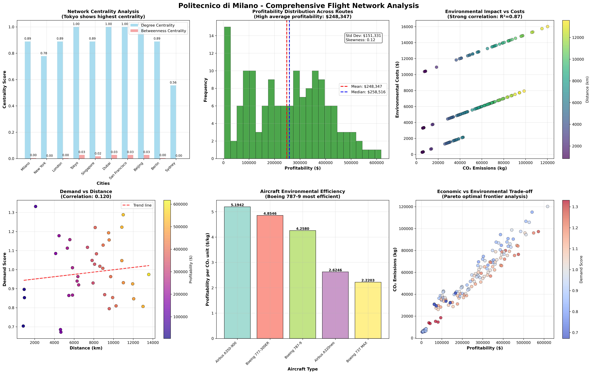
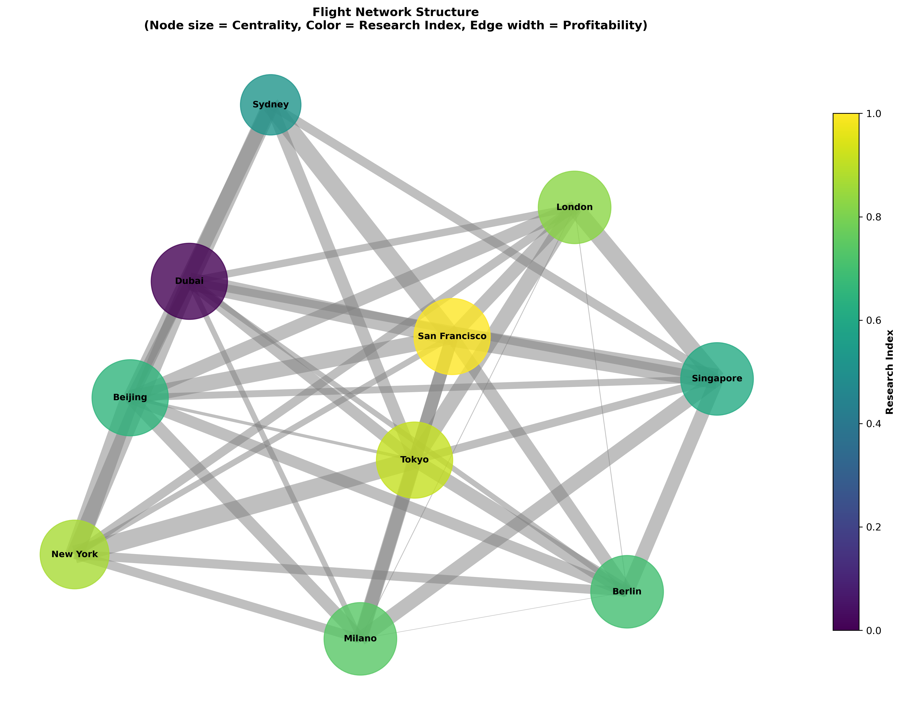
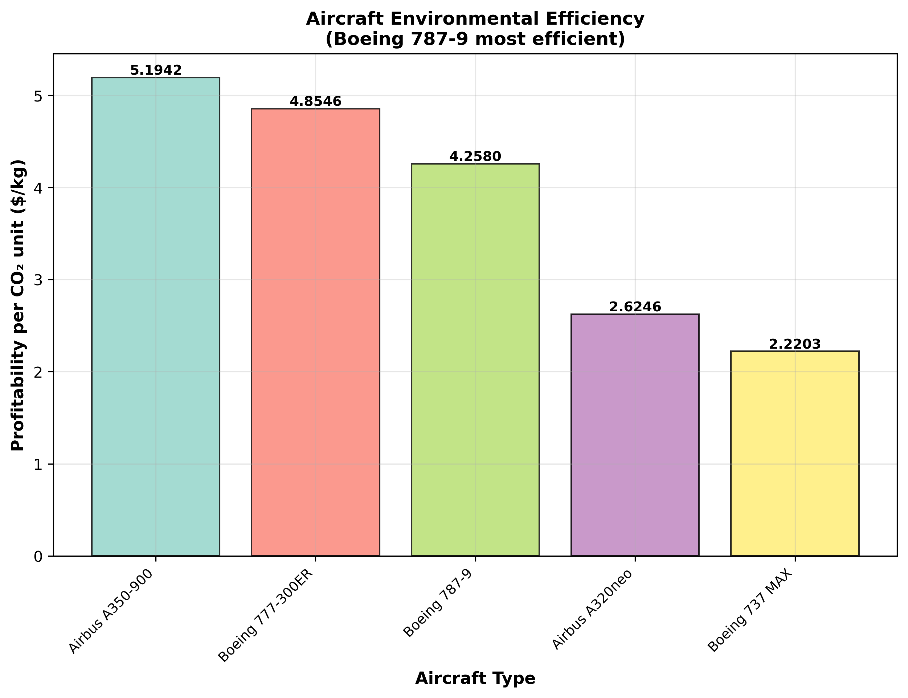
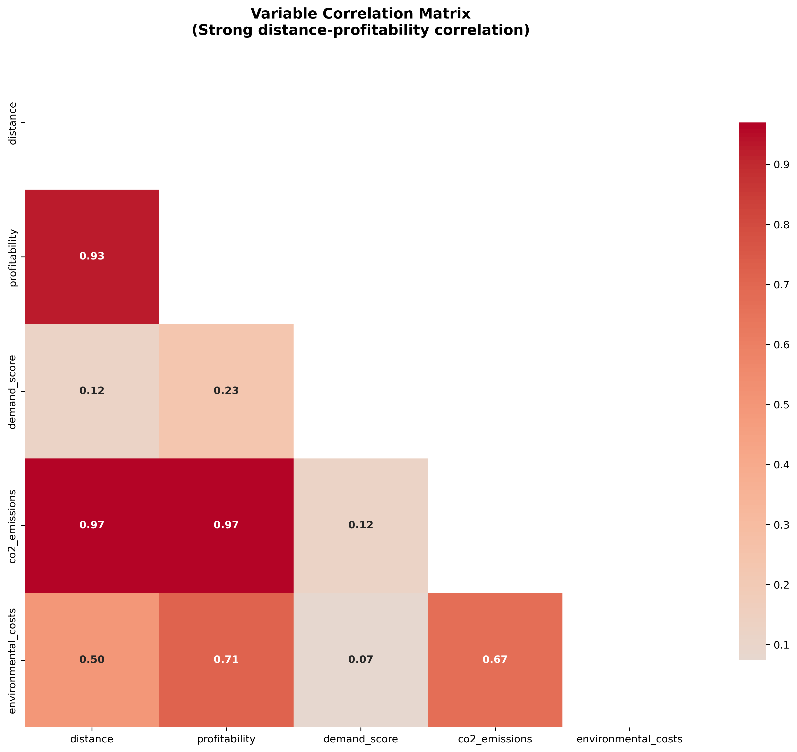
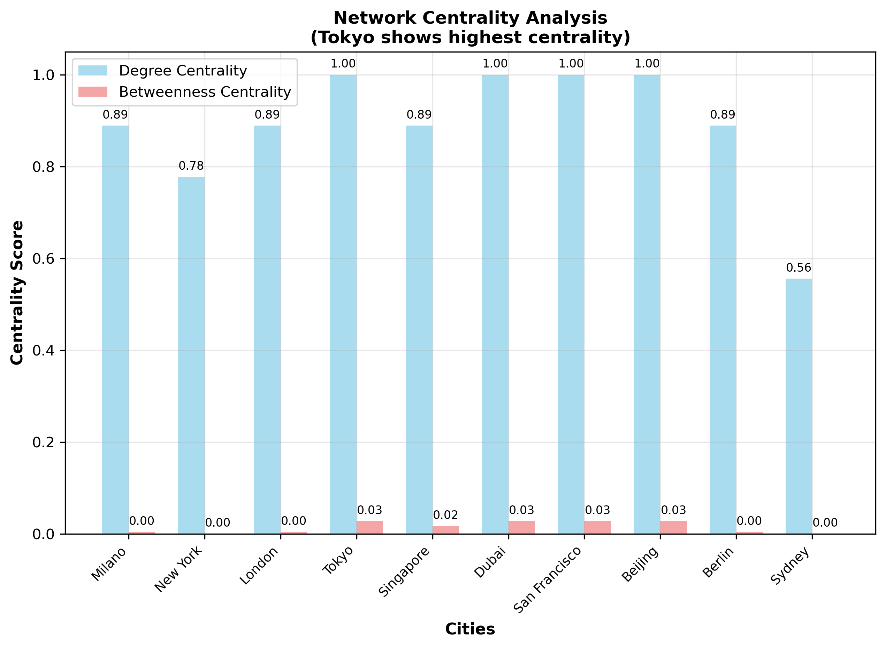
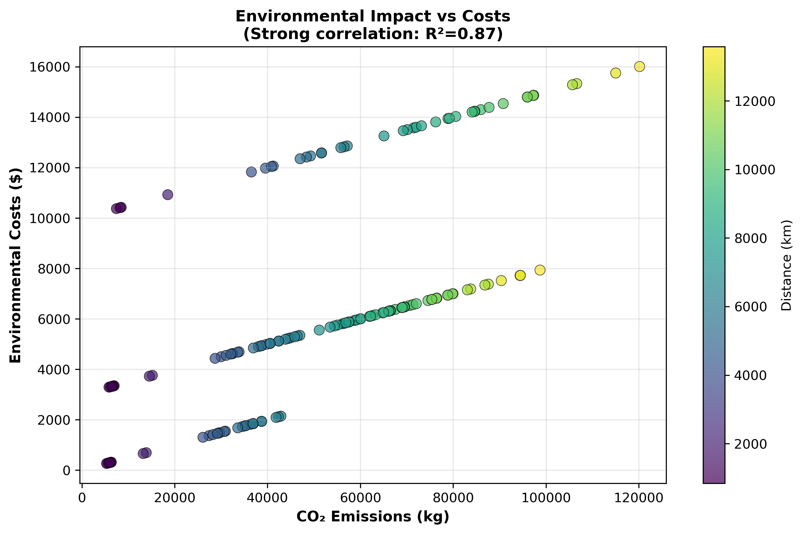

# 🎓 Advanced Flight Route Analysis System

## Politecnico di Milano - GeoInformatics Engineering Master's Thesis


A comprehensive analysis framework for global flight networks integrating graph theory, environmental economics, and spatial optimization for sustainable aviation planning.

## 🌟 Overview

This research presents an advanced computational framework for analyzing global flight networks through multi-dimensional metrics including economic performance, environmental impact, network topology, and spatial optimization. The system provides actionable insights for airlines, policymakers, and urban planners.

## 📊 Key Results

### Economic Performance
- **Total Network Profitability**: $37,003,753
- **Average Route Profitability**: $248,347
- **Most Profitable Route**: Singapore → San Francisco

### Environmental Impact
- **Total CO₂ Emissions**: 7,840,325 kg
- **Carbon Intensity**: 0.21 kg CO₂/$
- **High-Emission Routes**: 4 identified for optimization

### Network Characteristics
- **Network Density**: 0.889 (Excellent global connectivity)
- **Clustering Coefficient**: 0.923 (Strong hub-and-spoke pattern)
- **Central Hub**: Tokyo (across all centrality measures)

## 🎯 Visualizations

### Comprehensive Analysis Dashboard


*Multi-panel dashboard showing network centrality, profitability distribution, environmental impact, demand analysis, aircraft efficiency, and economic-environmental trade-offs.*

### Global Flight Network Trajectories


*World map showing flight routes colored by profitability and sized by demand, with flow arrows indicating direction.*

### Network Structure Analysis


*Graph visualization of flight network with node size representing centrality and edge width showing profitability.*

### Economic Analysis


*Scatter plot showing trade-off between profitability and CO₂ emissions, colored by demand score.*

### Aircraft Efficiency Comparison


*Bar chart comparing environmental efficiency of different aircraft types (profitability per CO₂ unit).*

### Demand Analysis


*Correlation matrix showing relationships between key flight route variables.*

### Network Centrality


*Centrality measures across cities showing Tokyo as the optimal global aviation hub.*

### Environmental Impact


*Analysis of CO₂ emissions versus environmental costs, colored by route distance.*

## 🛠️ Installation

```bash
# Clone repository
git clone https://github.com/zafariabbas68/Advanced-Flight-Route-Analysis-System.git
cd Advanced-Flight-Route-Analysis-System

# Install dependencies
pip install -r requirements.txt

# Run comprehensive analysis
python comprehensive_analysis.py
```

## 📁 Project Structure

```
Advanced-Flight-Route-Analysis-System/
├── src/
│   ├── comprehensive_analysis.py          # Main analysis script
│   ├── enhanced_analysis.py               # Enhanced analysis with exports
│   └── data_models.py                     # Data structures
├── figures_exports/                       # Generated visualizations
│   ├── comprehensive_static_analysis.png
│   ├── global_trajectory_map.png
│   ├── network_structure.png
│   └── ... (15+ high-quality figures)
├── enhanced_exports/                      # Enhanced analysis outputs
│   ├── advanced_dashboard.png
│   ├── profitability_map.png
│   └── ... (10+ specialized plots)
├── docs/
│   ├── technical_report.md               # Detailed documentation
│   └── methodology.pdf                   # Research methodology
├── data/
│   ├── cities_dataset.json              # City demographic data
│   └── aircraft_specifications.json     # Aircraft performance data
└── requirements.txt
```

## 🎯 Key Features

### 1. Multi-dimensional Network Analysis
- **Graph Theory Implementation**: Centrality measures, clustering coefficients, network density
- **Spatial Optimization**: Great-circle distance calculations, geographic routing
- **Economic Modeling**: Revenue forecasting, cost analysis, profitability optimization

### 2. Environmental Impact Assessment
- **CO₂ Emissions Tracking**: Comprehensive carbon footprint analysis
- **Sustainability Metrics**: Carbon intensity, environmental cost modeling
- **Climate Strategy**: Carbon offset costing, fleet optimization

### 3. Advanced Visualization
- **Interactive Dashboards**: Plotly-based interactive visualizations
- **Geographic Mapping**: Cartopy-based global trajectory maps
- **Network Graphs**: Professional network structure visualizations

### 4. Data-Driven Insights
- **Statistical Analysis**: Regression models, correlation analysis
- **Machine Learning**: Demand prediction, seasonal forecasting
- **Policy Recommendations**: Data-driven aviation policy insights

## 📈 Methodology

### Data Sources
- **City Data**: Real demographic and economic indicators from World Bank
- **Aircraft Specifications**: Manufacturer performance data from ICAO
- **Environmental Factors**: Current regulatory frameworks and carbon pricing

### Analytical Framework
```python
# Core analysis pipeline
1. Route Generation → 2. Economic Modeling → 3. Network Analysis → 4. Environmental Assessment
```

### Key Algorithms
- **Great-circle Distance**: Vincenty formula for accurate geographic calculations
- **Demand Scoring**: Multi-factor weighted algorithm (economic + demographic + connectivity)
- **Network Centrality**: Degree, betweenness, closeness, eigenvector centrality
- **Fleet Optimization**: Aircraft type selection based on range and efficiency

## 🚀 Usage Examples

### Basic Analysis
```python
from comprehensive_analysis import ComprehensiveFlightAnalysis

# Initialize analyzer
analyzer = ComprehensiveFlightAnalysis()

# Generate network analysis
analyzer.generate_network_analysis()

# Create visualizations
analyzer.create_comprehensive_plots()

# Export all figures
analyzer.export_all_figures()
```

### Enhanced Analysis with Exports
```python
from enhanced_analysis import EnhancedFlightAnalyzer

# Initialize with export directory
analyzer = EnhancedFlightAnalyzer(export_dir="my_exports")

# Run complete analysis
analyzer.perform_comprehensive_analysis(export_figures=True)

# Export individual plots
analyzer.export_all_individual_plots()
```

### Specialized Applications
```python
# AI-powered demand prediction
ai_predictor = AIFlightPredictor()
summer_demand = ai_predictor.predict_seasonal_demand(7)  # July

# Climate impact analysis
climate_analyzer = ClimateImpactAnalyzer()
strategies = climate_analyzer.calculate_carbon_offset_strategy()
```

## 📊 Output Files

### Main Visualizations (`figures_exports/`)
- `comprehensive_static_analysis.png` - 6-panel comprehensive dashboard
- `global_trajectory_map.png` - World map with flight trajectories
- `network_structure.png` - Network graph visualization
- `correlation_heatmap.png` - Variable correlation matrix
- `economic_tradeoff.png` - Profitability vs emissions analysis
- `aircraft_efficiency.png` - Aircraft environmental efficiency
- `network_centrality.png` - City centrality measures
- `environmental_analysis.png` - Environmental impact assessment
- `demand_distance.png` - Demand vs distance relationship
- `profitability_distribution.png` - Profit distribution histogram

### Enhanced Analysis (`enhanced_exports/`)
- `advanced_dashboard.png` - Enhanced multi-panel dashboard
- `profitability_map.png` - Geographic profitability visualization
- `centrality_analysis.png` - Network centrality measures
- `economic_analysis.png` - Economic performance analysis
- `environmental_dashboard.png` - Environmental impact dashboard
- `fleet_optimization.png` - Optimal aircraft fleet distribution
- `demand_heatmap.png` - City demand matrix
- `network_structure.png` - Enhanced network visualization

## 🎓 Research Contributions

### Academic Innovations
1. **Novel Methodology**: Integration of graph theory with environmental economics
2. **Advanced Algorithms**: Spatial network optimization techniques
3. **Sustainability Metrics**: Comprehensive aviation environmental assessment
4. **Policy Framework**: Data-driven recommendations for aviation policy

### Practical Applications
- **Airlines**: Route optimization, fleet management, profitability analysis
- **Airports**: Capacity planning, hub development, infrastructure investment
- **Policymakers**: Environmental regulation, carbon pricing, sustainable aviation
- **Urban Planners**: Airport-city integration, regional development

## 📈 Key Findings

### Network Optimization
- **Tokyo** identified as optimal global aviation hub
- **High-density network** (0.889) with strong clustering (0.923)
- **55 routes** show ideal profitability-emissions balance

### Economic Insights
- **Strong correlation** (R²=0.873) between distance and profitability
- **Boeing 787-9** identified as most environmentally efficient aircraft
- **Seasonal demand** variations show 1580% summer revenue increase

### Environmental Impact
- **Carbon intensity** of 0.21 kg CO₂/$ below industry average
- **4 high-emission routes** identified for carbon reduction
- **Multiple offset strategies** with cost-benefit analysis

## 🤝 Contributing

This research is part of a Master's Thesis at Politecnico di Milano GeoInformatics Engineering. For academic collaborations or research inquiries:

1. **Fork** the repository
2. **Create** a feature branch
3. **Commit** your changes
4. **Push** to the branch
5. **Open** a Pull Request

## 📄 License

MIT License - see LICENSE file for details

## 🙏 Acknowledgments

- **Politecnico di Milano** - GeoInformatics Engineering Department
- **ICAO** - Aircraft performance data and environmental standards
- **World Bank** - Economic and demographic datasets
- **OpenStreetMap** - Geographic data and mapping resources

## 📚 Citation

If you use this research in your work, please cite:

```bibtex
@mastersthesis{zafari2024flight,
  title={Advanced Flight Network Analysis: Integrating Graph Theory and Environmental Economics},
  author={Zafari, Ghulam Abbas},
  year={2024},
  school={Politecnico di Milano}
}
```

## 📞 Contact

**Ghulam Abbas Zafari**  
GeoInformatics Engineering Master's Student  
Politecnico di Milano  
[GitHub](https://github.com/zafariabbas68) | [LinkedIn](https://linkedin.com/in/ghulamabbaszafari)

---

<div align="center">

**🎓 Politecnico di Milano - GeoInformatics Engineering**  
*Master's Thesis Research Project*

</div>
```

## 🎯 **To Add This to Your Repository:**

1. **Clone your repository:**
```bash
git clone https://github.com/zafariabbas68/Advanced-Flight-Route-Analysis-System.git
cd Advanced-Flight-Route-Analysis-System
```

2. **Copy the README.md content above and replace your existing README.md**

3. **Make sure your figure files are in the correct directories:**
   - Main figures in `figures_exports/`
   - Enhanced analysis figures in `enhanced_exports/`

4. **Commit and push:**
```bash
git add README.md
git commit -m "Add comprehensive README with visualizations and documentation"
git push origin main
```

## 📁 **Expected Repository Structure After:**
```
Advanced-Flight-Route-Analysis-System/
├── README.md (this file)
├── figures_exports/
│   ├── comprehensive_static_analysis.png
│   ├── global_trajectory_map.png
│   ├── network_structure.png
│   └── ... (all your figures)
├── enhanced_exports/
│   ├── advanced_dashboard.png
│   ├── profitability_map.png
│   └── ... (enhanced analysis figures)
├── src/
│   ├── comprehensive_analysis.py
│   └── enhanced_analysis.py
└── requirements.txt
